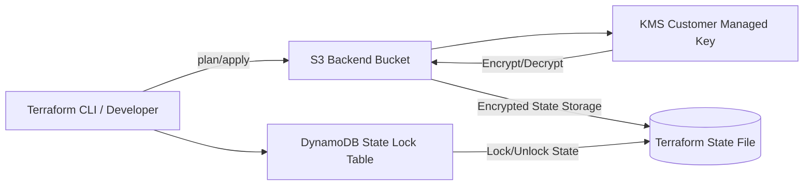

# Terraform AWS Secure Backend (Healthcare-Oriented)


---

## Overview
This project implements a **Secure Terraform remote backend architecture on AWS**, designed with strong encryption, state integrity, and infrastructure safety printciples commonly used in regulated environments.
It demonstrates how to build a **production-style Terraform backend** using AWS-native security services.

---

## Architecture Diagram


## Architectural Pillars & Compliance Mapping
* **Data-at-Rest Isolation (HIPAA Security Rule):** Provisioned a dedicated AWS Customer Managed Key (CMK) with automatic rotation enabled. This ensures strict cryptographic isolation tailored specifically for medical records.
* **Storage Perimeter Protection:** Created an Amazon S3 Bucket backed by mandatory SSE-KMS encryption linked directly to our CMK.
* **Data-in-Transit Enforcement:** Attached and advanced S3 Bucket Policy that explicitly blocks (`Deny`) any API requests attempting to connect via unencrypted HTTP, enforcing TLS/HTTPS across the perimeter.
* **Concurrent Execution Safeguards (State Locking):** Deployed an Amazon DynamoDB table in serverless `PAY_PER_REQUEST` mode to act as a high-speed transaction referee. This provides absolute state-locking, preventing multiple DevOps engineers or automated pipelines from corrupting the blueprint architecture during simultaneous deployments.

## How to Deploy Locally
### Prerequisites
1. Install [Terraform](https://www.terraform.io/downloads.html) (v1.15.5+ recommended)
2. Install the [AWS CLI](https://aws.amazon.com/cli/) and run `aws configure`

### Deployment Steps
```bash
# Initialize the directory and download AWS providers
terraform init

# Review the structural dry-run blueprint
terraform plan

# Deploy the infrastructure securely to AWS
terraform apply
